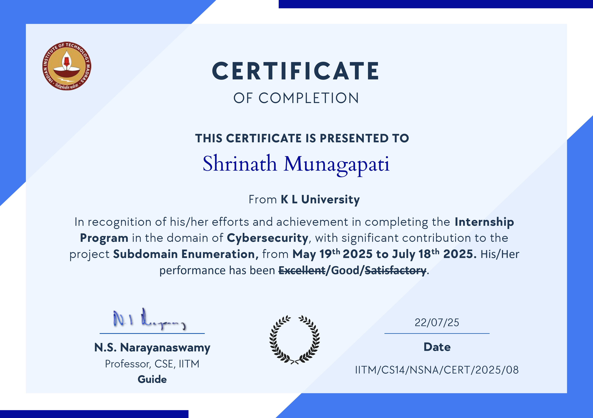

# IITM Subdomain Enumeration Tool (Knockpy + Subfinder)

I built this tool during my internship at **IITM CyStar** to support subdomain reconnaissance and reporting workflows. After the internship, I continued developing it — adding new features, improving the UI, and expanding the toolset.

### Internship Certificate



- LinkedIn Post: [View Post](https://www.linkedin.com/feed/update/urn:li:activity:7354341162909921284/)

This project now supports both **Knockpy** and **Subfinder** pipelines, with a Flask dashboard to visualize and compare outputs.

## What This Tool Does

- Enumerates subdomains for a target domain (currently configured for `iitm.ac.in`).
- Runs scans via Knockpy and Subfinder.
- Loads results and supporting metadata (HTTP status, certificate and related tool outputs).
- Shows results through web pages and streamed progress updates.

## Key Features

- Dual-engine scanning (Knockpy + Subfinder) with SSE progress streaming
- Multi-page Flask UI with interactive charts and domain filtering
- Tech stack detection (Wappalyzer), SSL cert scanning, DNS resolution (dnsx)
- Nmap port scanning, dark/light theme, reusable JS/CSS architecture

## Project Structure

- `app.py` - Main Flask app with routes and API endpoints.
- `Dockerfile` - Container setup for consistent execution.
- `requirements.txt` - Python dependencies.
- `README.md` - Project documentation.
- `data/` - Stored JSON output for Knockpy/Subfinder runs.
- `tools/` - External reconnaissance binaries and outputs:
    - `subfinder.exe` - Subdomain discovery tool
    - `dnsx.exe` - DNS resolver
    - `httpx.exe` - HTTP prober  
    - `sslscan.exe` - SSL certificate scanner
    - `wappalyzer.exe` - Technology detection
    - `txt/` - Raw/auxiliary outputs from recon tooling
- `templates/`
    - `index.html` - Landing/dashboard page.
    - `knockpy.html` - Knockpy scan page.
    - `subfinder.html` - Subfinder scan page.
- `static/css/` - Styles, variables, animations, dark theme.
- `static/js/` - Page scripts, shared utilities, alerts, cert/nmap handlers.
- `utils/`
    - `knockpy_runner.py` - Knockpy scan runner.
    - `subfinder_runner.py` - Subfinder scan runner.
    - `nmap_runner.py` - Nmap integration runner.
    - `config.py` - Runtime configuration.

## Installation

### Option 1: Run with Docker

```sh
docker build -t iitm-subd .
docker run -p 5000:5000 iitm-subd
```

### Option 2: Run locally

```sh
git clone https://github.com/MShrinath/iitmsubd
cd iitmsubd
pip install -r requirements.txt
python app.py
```

Open `http://127.0.0.1:5000` in your browser.
